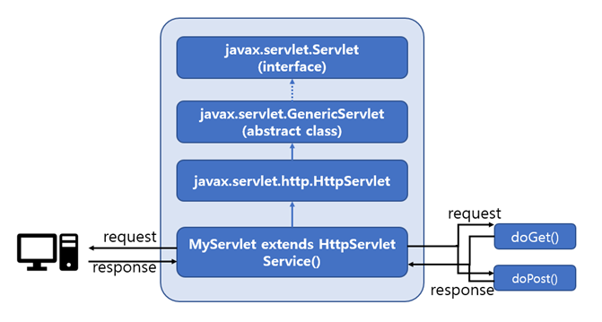

# FastCampus self-study
- 패스트캠퍼스 강의 - '나만의 MVC 프레임워크 만들기' 중 chapter4. 웹 애플리케이션 이해 강의 테스트 코드

## Chapter4 : 06.계산기 서블릿 만들기
- 환경: 웹 프로젝트 환경 (임베디드 톰캣)
- Preference(command+,) > gradle 검색 > build and run 에서 IntelliJ 로 변경
- Project Structure(command+;) > modules > main > path > output path: /servlet-practice/webapps/WEB-INF/classes
- Project Structure(command+;) > modules > test > path > output path: /servlet-practice/webapps/WEB-INF/test/classes

#### 추가
- was-practice 에서 만들었던 calculator 패키지 추가

### Servlet 상속 구조

- Servlet 인터페이스 구현 → Servlet 에서 필수로 구현하게 하기 때문에 필요하지 않은 메서드도 구현이 필요함 (상당히 비효율적)
- 위의 사유로 GenericServlet (abstract class) 등장하게 됨
=> Servlet 인터페이스 사용 시, 필요없는 메서드까지 구현해야 했음
=> GenericServlet 이라는 추상 클래스 사용 시, 필요한 메서드만 override 함!